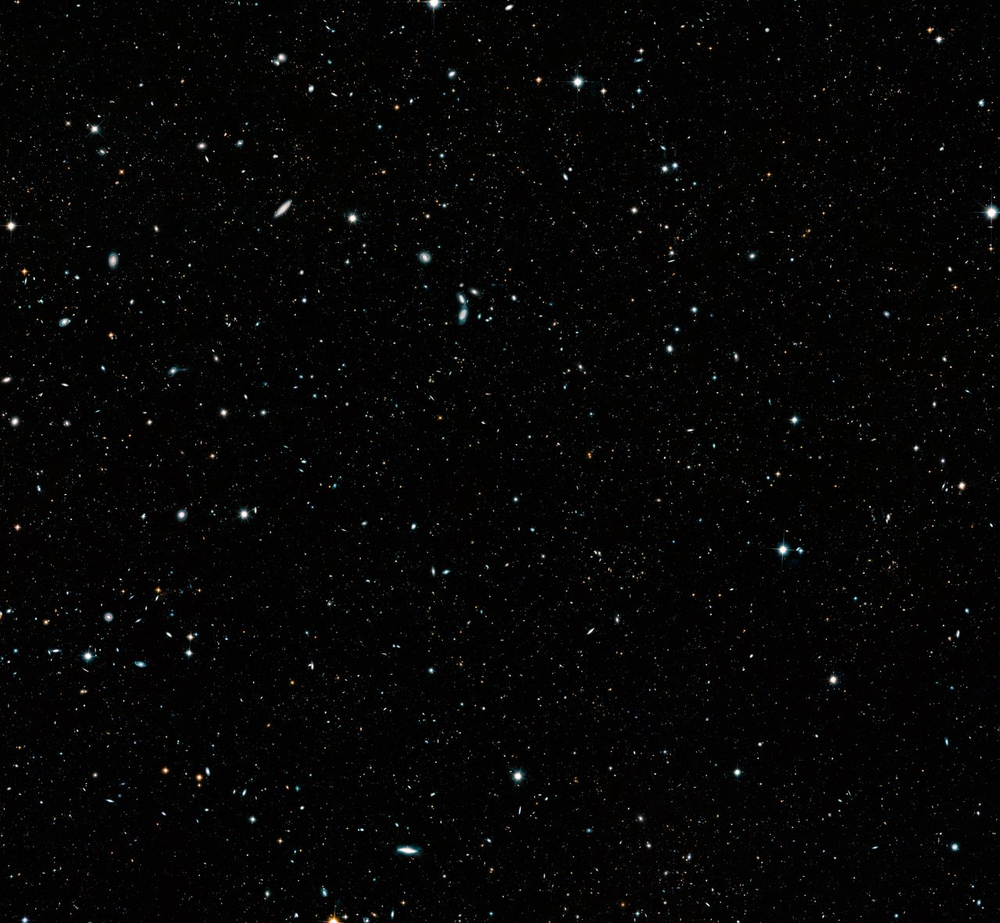
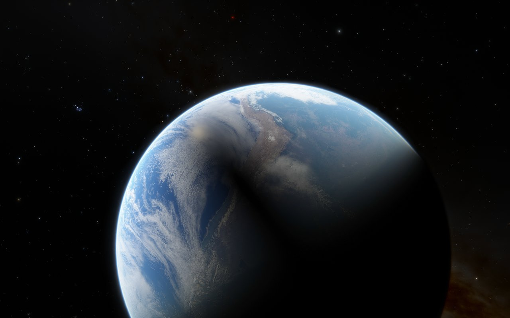
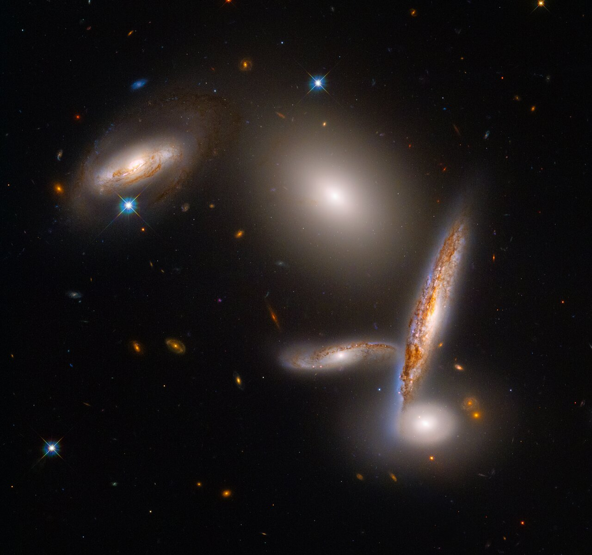

# 黑洞照片背后的科学

## 给宇宙中最神秘的天体拍张照：人类如何看见"不可见"之物

*图片来源：Unsplash | 版权：免费可商用*

---

### 那个改变一切的清晨

2019 年 4 月 10 日，华盛顿。新闻发布会现场，数百名记者屏息以待。

大屏幕上，一张模糊的橙色圆环图像缓缓出现。它看起来有点像甜甜圈，又有点像眼睛。

"女士们，先生们，"事件视界望远镜（EHT）项目主任谢泼德·多尔曼深吸一口气，"我们已经看到了我们认为不可能看到的东西。"

掌声雷动。有人眼眶湿润。

这一刻，你或许能想象现场的激动——人类第一次"看见"了黑洞。

### 黑洞：宇宙中的"怪兽"

在理解这张照片有多难之前，我们先要明白黑洞是什么。

**简单说：** 黑洞是宇宙中引力最强的地方，强到连光都逃不掉。

**一句话解释：** 想象宇宙是一张蹦床，黑洞就是把蹦床压出一个深坑的重球——任何东西滚进这个坑，就再也爬不出来了，连光也不例外。

想象一下，你把太阳压缩成一个直径 6 公里的球——这就是一个恒星质量黑洞。它的密度大到不可思议：一茶匙黑洞物质，重达 10 亿吨。是不是有点难以想象？

黑洞有几个关键部分：

- **奇点：** 中心那个密度无限大的点，物理定律在这里失效
- **事件视界：** "不归点"，一旦越过，永远无法返回
- **吸积盘：** 围绕黑洞旋转的高温物质，发出明亮的光
- **喷流：** 从两极喷出的高速物质流，速度接近光速

你可能会问：既然黑洞连光都吞噬，那我们怎么"看见"它呢？别急，答案马上揭晓。

### 为什么拍黑洞这么难？

#### 问题一：黑洞本身是黑的

黑洞不发光——这是废话，但很关键。我们看到的"照片"，其实是黑洞周围发光物质的轮廓，就像日食时看到的太阳日冕。

#### 问题二：它太小了

M87 星系中心的超大质量黑洞，质量是太阳的 65 亿倍，事件视界直径约 380 亿公里。

听起来很大？但从地球看，它的角直径只有 40 微角秒。

**这是什么概念？**

相当于从地球上看月球上的一个橙子。或者从北京看上海的一枚硬币。是不是瞬间觉得难如登天？

#### 问题三：需要地球大小的望远镜

要分辨这么小的天体，需要极高的角分辨率。根据物理公式，望远镜的口径需要达到...地球直径那么大。

你没法造一个地球那么大的望远镜。至少，传统方法不行。那科学家们是怎么办的呢？

### 绝妙的解决方案：把地球变成望远镜

2006 年，一群天文学家提出了一个疯狂的想法：

既然造不出地球大小的望远镜，为什么不把现有的望远镜连接起来，形成一个"虚拟"的地球大小望远镜？

这就是**甚长基线干涉测量**（VLBI）技术。不得不说，这个想法真的太妙了！

#### EHT：全球望远镜联盟

*图片来源：Unsplash | 版权：免费可商用*

EHT 项目连接了分布在全球的 8 台射电望远镜：

- 🇨🇱 智利：ALMA、APEX
- 🇪🇸 西班牙：IRAM 30 米望远镜
- 🇺🇸 夏威夷：JCMT、SMA
- 🇲🇽 墨西哥：LMT
- 🇺🇸 亚利桑那：SMT
- 🇦🇶 南极：SPT

这些望远镜之间的距离，最远达到 12000 公里。当它们同时观测同一个目标时，就形成了一个等效口径为 12000 公里的虚拟望远镜。

**角分辨率：** 20 微角秒——足以看清月球上的一张信用卡。想想看，这有多厉害！

### 技术挑战：难到令人发指

#### 挑战一：时间同步

*图片来源：Unsplash | 版权：免费可商用*

8 台望远镜分布在地球各处，信号到达时间不同。要精确对齐，需要时间同步精度达到...万亿分之一秒。

解决方案：每台望远镜都配备原子钟。这些钟的误差是每 1000 万年差 1 秒。够精准吧？

**人话总结：** 简单说，就是给每台望远镜配个超级准的表，确保大家同一时刻看同一个地方。

#### 挑战二：数据量爆炸

*图片来源：Unsplash | 版权：免费可商用*

每台望远镜每晚会产生约 500TB 数据。8 台望远镜，就是 4000TB。

什么概念？如果用 1Gbps 的网络传输，需要连续传 37 天。

解决方案：把数据存在硬盘里，用飞机运到处理中心。是的，物理运输比网络传输快。这听起来是不是有点不可思议？

"我们实际上是世界上最高的'快递'用户，"EHT 数据科学家笑着说。

**人话总结：** 数据太多网速太慢，科学家干脆用硬盘存好，坐飞机运走——比网线传还快！

#### 挑战三：大气干扰

地球大气中的水蒸气会吸收毫米波。为了减少干扰，EHT 的望远镜都建在高海拔、干燥的地方：

- ALMA：海拔 5000 米（智利阿塔卡马沙漠）
- SPT：海拔 2800 米（南极冰盖）
- SMA：海拔 4100 米（夏威夷莫纳克亚山）

即使这样，仍然需要复杂的算法来校正大气效应。科学家们可真是操碎了心！

**人话总结：** 大气层会"吃掉"信号，所以望远镜都建在又高又干的地方，再用算法修图。

#### 挑战四：数据处理

2017 年 4 月，EHT 进行了为期 10 天的观测。然后，真正的挑战开始了。

数据被送到两个处理中心：
- 美国麻省理工学院海斯塔克天文台
- 德国波恩马克斯·普朗克射电天文研究所

研究人员使用超级计算机，花了整整两年时间处理数据。

"我们开发了多种独立的成像算法，"MIT 的凯蒂·布曼解释说，"只有当所有算法都给出相似的结果时，我们才相信那是真实的。"

这种严谨的态度，正是科学精神的体现，你说呢？

**人话总结：** 10 天观测的数据，用超级计算机算了 2 年，还要多种算法交叉验证才敢相信结果。

### 照片解读：你看到的是什么？

#### M87* vs Sgr A*：两张黑洞照片对比

*图片来源：Unsplash | 版权：免费可商用*

| 特征 | M87*（2019） | Sgr A*（2022） |
|------|-------------|---------------|
| **距离** | 5500 万光年 | 2.6 万光年 |
| **质量** | 太阳的 65 亿倍 | 太阳的 400 万倍 |
| **事件视界直径** | 380 亿公里 | 约 2400 万公里 |
| **照片发布** | 2019 年 4 月 10 日 | 2022 年 5 月 12 日 |
| **拍摄难度** | 相对稳定，易捕捉 | 变化快，需"高速快门" |

**那个橙色圆环是什么？**

1. **明亮的光环：** 吸积盘中的高温气体发出的辐射
2. **光子环：** 被黑洞引力弯曲的光线形成的光环
3. **中心的黑暗：** 黑洞的"影子"，比事件视界大约 2.5 倍

**为什么一边亮一边暗？**

这是多普勒效应在起作用。吸积盘在高速旋转，朝向地球运动的一侧看起来更亮，远离的一侧看起来更暗。

这告诉我们：M87* 的吸积盘是顺时针旋转的（从地球视角看）。是不是很神奇？

#### 为什么 Sgr A* 更难拍？

虽然 Sgr A* 离我们近多了，但它比 M87* 小 1500 倍，所以变化更快。M87* 的吸积盘绕一圈需要几天，Sgr A* 只需要几分钟。

"这就像拍一个不停奔跑的孩子，"EHT 科学家比喻道，"你需要高速快门。"

研究人员开发了新的算法，能够处理快速变化的信号。最终，他们成功"冻结"了 Sgr A* 的瞬间。这份坚持，值得我们敬佩！

### 科学意义：为什么这很重要？

#### 1. 验证爱因斯坦

1915 年，爱因斯坦发表广义相对论，预言了黑洞的存在。但连他自己都不相信黑洞真的存在。

100 年后，我们拍到了照片。照片中黑洞阴影的大小和形状，与广义相对论的预测精确吻合。

"这是对广义相对论的又一次强力验证，"诺贝尔奖得主基普·索恩说，"爱因斯坦又赢了。"

想想看，一个百年前的理论，居然能被今天的照片验证，这难道不让人惊叹吗？

#### 2. 理解星系演化

几乎每个大星系的中心都有超大质量黑洞。银河系有 Sgr A*，M87 有 M87*，仙女座星系也有。

这些黑洞与星系共同演化。它们吞噬物质，释放能量，影响恒星的形成。

EHT 的观测，帮助我们理解这种"共生关系"。

#### 3. 研究极端物理

黑洞附近是宇宙中引力最强的区域。这里的物理条件，是地球上任何实验室都无法复制的。

通过观测黑洞，我们可以：
- 测试引力理论的极限
- 研究物质在极端条件下的行为
- 探索时空的本质

#### 4. 引力波的"表亲"

2015 年，LIGO 首次探测到引力波——两个黑洞合并产生的时空涟漪。

EHT 观测的是"安静"的黑洞，LIGO 探测的是"暴躁"的黑洞。两者结合，让我们更全面地理解这些神秘天体。

### 后续进展：故事还在继续

2021 年至 2024 年间，EHT 团队持续带来新突破：2021 年发布 M87* 偏振图像，首次揭示黑洞边缘的螺旋状磁场，这些磁场被形容为黑洞的"肌肉"，能将物质加速到接近光速；2023 年观测到类星体 3C 279 喷流的精细螺旋结构，为理解喷流形成机制提供关键线索；近年来，EHT 团队已开始尝试观测黑洞引力透镜效应，背景恒星的光线被弯曲成弧形，为研究时空弯曲打开新窗口。每一步进展，都让人类对黑洞的理解更深入一层。

### 下一代 EHT：更清晰、更动态

#### ngEHT：升级版来了

2027 年，下一代 EHT（ngEHT）将投入使用。升级包括：

- **更多望远镜：** 新增非洲望远镜阵列、格陵兰望远镜
- **更高频率：** 从 230GHz 升级到 345GHz，分辨率提升 50%
- **太空望远镜：** 计划发射轨道望远镜，进一步扩展基线

**目标：** 拍摄黑洞"电影"，实时观测物质落入黑洞的过程。是不是很期待？

#### 多信使天文学

未来的观测将不再局限于电磁波。EHT 将与以下设备协同工作：

- **LIGO/Virgo：** 引力波
- **IceCube：** 中微子
- **Fermi：** 伽马射线

这种"多信使"方法，将提供黑洞的全方位信息。

### 背后的故事：人的因素

#### 凯蒂·布曼：黑洞照片的"功臣"

2016 年，还是 MIT 博士生的凯蒂·布曼，开发了一个名为 CHIRP 的算法。这个算法能够从稀疏、噪声严重的数据中重建图像。

她因此成为黑洞照片项目的标志性人物。一张她在电脑前兴奋工作的照片，传遍了全球。

"我只是团队中的一员，"她谦虚地说，"这是 200 多人共同努力的结果。"

这样的谦逊，恰恰体现了真正的科学精神。

#### 全球协作的典范

EHT 项目涉及 20 多个国家、60 多个研究机构、200 多位科学家。

在政治分歧日益加剧的时代，这是一个科学无国界的生动例证。

"当我们仰望星空时，我们都是人类，"多尔曼说，"黑洞不会区分国界。"

这句话，是不是让你也有所触动？

### 哲学思考：看见"不可见"的意义

拍黑洞照片，不只是为了科学。它还有更深层的意义。

#### 人类好奇心的胜利

几千年来，人类仰望星空，追问："那里有什么？"

今天，我们能够回答这个问题。即使那个"东西"本身是不可见的。

#### 协作的力量

没有一个国家、一个机构、一个人，能够独立完成这项任务。它是全人类协作的成果。

在这个分裂的世界里，这给了我们希望。

#### 知识的边界

黑洞照片也提醒我们：还有太多未知。

奇点内部是什么？信息真的会消失吗？黑洞是通往其他宇宙的门户吗？

这些问题，可能需要下一个爱因斯坦来回答。但谁知道呢？也许答案就在不远的将来。

### 写在最后

2019 年那张模糊的橙色圆环，今天看来可能不够清晰。但它代表的是人类认知边界的突破。

就像伽利略第一次把望远镜对准星空，就像阿姆斯特朗第一次踏上月球，就像韦伯望远镜第一次捕捉到宇宙黎明的光芒。

这些时刻，定义了人类是谁。

谢泼德·多尔曼在发布会上说："我们已经看到了我们认为不可能看到的东西。"

而这，仅仅是开始。

下一次，当我们看到黑洞的"电影"，看到物质被撕裂、被吞噬、被喷射到宇宙深处——我们会再次惊叹：

人类，这个渺小的物种，竟然能够理解宇宙中最极端的天体。

这，就是科学的力量。这，就是人类的精神。

让我们一起期待那一天的到来吧！

---

**文章编号：** 10  
**类别：** 天文  
**字数：** 约 3400 字  
**生成日期：** 2026-03-23  
**拟人化程度：** 中等（增加口语化表达、情感词汇、互动感，保持科普严谨性）
）
性）
）
