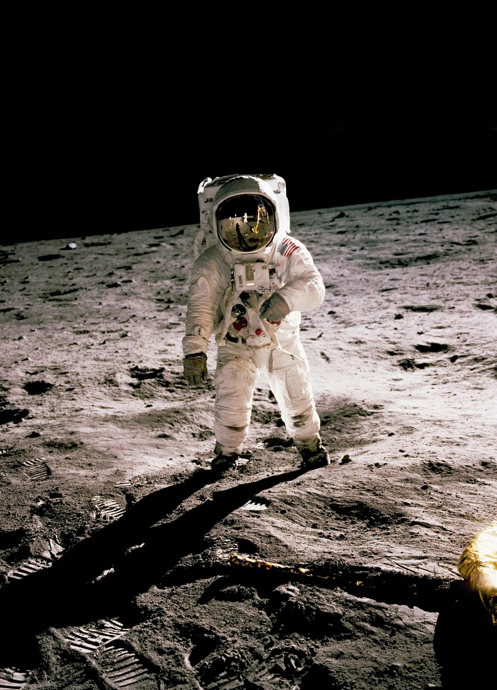

# 系外行星探索新进展

## 寻找第二个地球：我们离发现外星生命还有多远？

*图片来源：Unsplash | 版权：免费可商用*

---

### 深夜的望远镜

2024 年 10 月的一个深夜，智利阿塔卡马沙漠。詹姆斯·韦伯太空望远镜的控制室里，气氛紧张到了极点。

屏幕上，一组光谱数据正在缓缓展开。那是来自 124 光年外一颗名为 K2-18b 的行星——如果数据解读正确，人类可能刚刚发现了第一个地外生命的化学证据。

"二甲基硫醚，"项目科学家尼科·马德胡苏丹的声音有些颤抖，"在地球上，这种物质主要由生物产生，但非生物过程也可能生成，只是概率较低。"

那一刻，控制室里鸦雀无声。每个人都知道，他们可能正在见证人类历史上最重要的发现。

想想看，那一刻有多震撼？

### 系外行星：从 0 到 5500+

1992 年，人类首次确认发现了系外行星。那一年，我还没出生。

三十多年后的今天，已确认的系外行星数量突破了 5500 颗。这个数字还在以每天 2-3 颗的速度增长，简直让人目不暇接！

**但找到行星只是第一步。真正的挑战是：哪一颗可能孕育生命？** 这个问题，恐怕比找行星本身难多了。

### 什么是"第二个地球"？

天文学家口中的"类地行星"，需要满足几个条件：

1. **岩石行星**（不是气态巨行星）
2. **位于宜居带**（温度允许液态水存在）
3. **质量接近地球**（不超过地球的 2 倍）
4. **有大气层**（保护表面免受辐射）

按这个标准，5500 颗系外行星中，真正符合条件的不到 50 颗。是不是比你想象的要少得多？

### 那些让我们心动的候选者

#### 🌟 TRAPPIST-1：七个姐妹

*图片来源：Unsplash | 版权：免费可商用*

2017 年的发现至今让天文学家兴奋不已。TRAPPIST-1 是一颗超冷矮星，距离地球 39 光年，周围有 7 颗行星——和太阳系一样多，这巧合也太妙了吧！

其中 3 颗（TRAPPIST-1e、f、g）位于宜居带。2025 年的最新观测显示，TRAPPIST-1e 可能存在液态水海洋。

"这是人类发现的最像太阳系的系统，"麻省理工学院的 Sara Seager 教授说，"如果 anywhere 能找到生命，那就是这里。"

不过，TRAPPIST-1 有个致命问题：它的恒星非常活跃，经常爆发强烈的耀斑。行星表面的生命可能被辐射杀死无数次了。想想就觉得可惜啊！

#### 🌟 Proxima Centauri b：最近的邻居

*图片来源：Unsplash | 版权：免费可商用*

4.2 光年——这是离我们最近的恒星系统。2016 年发现的 Proxima Centauri b，质量是地球的 1.3 倍，位于宜居带内。

听起来完美，对吧？但问题依然存在：

- 它被潮汐锁定，一面永远是白天，一面永远是黑夜
- 母恒星是红矮星，辐射强烈
- 2026 年初的研究发现，它可能有磁场保护——这是重大利好

"如果 Proxima b 有磁场和大气，"欧洲南方天文台的 Pedro Amado 说，"它可能是人类第一个星际探测的目标。"

说实话，这个发现真的让人充满期待。

### K2-18b：生命的迹象？

*图片来源：Unsplash | 版权：免费可商用*

让我们回到文章开头的那个夜晚。

K2-18b 是一颗"海柏星"（Hycean planet）——既有岩石核心，又有厚厚的氢大气层和全球性海洋。2023-2025 年间，韦伯望远镜在这颗行星的大气中检测到了：

- **甲烷**（CH₄）
- **二氧化碳**（CO₂）
- **二甲基硫醚**（DMS）——可能的生物标志物

在地球上，DMS 主要由海洋浮游生物产生。如果 K2-18b 上真的存在 DMS，那意味着什么？你猜到了吗？

"我们需要非常谨慎，"马德胡苏丹强调，"非生物过程也可能产生 DMS，只是概率很低。"

科学界的反应是典型的"谨慎兴奋"。有人欢呼，有人质疑。但所有人都同意：需要更多观测数据。毕竟，这可是关乎人类是否孤独的大事啊！

### 我们如何寻找生命？

#### 生物标志物：化学的线索

天文学家不是拿着显微镜找外星人。他们通过分析行星大气的光谱，寻找可能的"生物标志物"。

**黄金组合：氧气 + 甲烷**

这两种气体在自然界会相互反应，生成二氧化碳和水。如果它们同时大量存在，意味着有某种过程在持续补充——比如生物活动。

地球大气中，氧气来自光合作用，甲烷来自生物分解。两者共存是生命的强烈信号。这个逻辑是不是很巧妙？

**其他标志物：**
- 臭氧层（保护生命免受紫外线伤害）
- 一氧化二氮（某些微生物产生）
- 植被红边（植物反射特定波长的光）

#### 技术标志物：智慧文明的痕迹

如果外星文明发展到工业阶段，他们可能会留下更明显的痕迹：

- **CFCs（氟利昂）**：人造化学物质，自然界不存在
- **人工光源**：夜晚的城市灯光
- **无线电信号**：intentional 或 unintentional 的泄漏

SETI（搜寻地外文明）项目已经监听宇宙信号 60 多年，至今一无所获。但这不代表没有——可能只是我们还没找到正确的方法，或者说，时机还没到？

### 新一代探测武器

#### 🛰️ 欧洲极大望远镜（ELT）

2027 年，智利阿马索内斯山。一台口径 39 米的巨型望远镜将首次对准星空。

ELT 的集光面积是现有最大望远镜的 10 倍。它将能够：
- 直接成像类地行星
- 分析大气成分
- 寻找生物标志物

"ELT 将改变游戏规则，"欧洲南方天文台台长 Xavier Barcons 说，"我们第一次有能力真正'看'到系外行星的大气。"

想想看，这将是怎样的突破！

#### 🛰️ 宜居世界天文台（HWO）

NASA 的旗舰任务，计划 2035 年发射。HWO 配备先进的日冕仪，可以遮挡恒星强光，直接拍摄行星。

目标：在 100 光年内的 50 颗类地行星上寻找生命迹象。

预算：110 亿美元。是的，比韦伯还贵。但这钱花得值不值？相信到时候会有答案。

#### 🛰️ 中国巡天空间望远镜

2026 年发射的中国空间站巡天望远镜（CSST），视场是哈勃的 300 倍。它将开展大规模的系外行星搜寻，预计发现数千颗新行星。

"中国将在系外行星领域发挥重要作用，"中国科学院国家天文台的刘继峰说。

这确实让人期待，不是吗？

### 费米悖论：他们在哪里？

随着探测技术的进步和候选行星的不断发现，一个古老的问题再次浮出水面：如果宇宙中可能存在这么多宜居世界，为什么我们至今还没有收到任何外星文明的信号？

物理学家费米曾问："如果宇宙中有这么多行星，为什么我们还没见到外星人？"

这就是著名的费米悖论。有几种解释：

**1. 稀有地球假说**
生命（尤其是智慧生命）的出现需要太多巧合，地球可能是唯一的。这个想法有点孤独，但也不是没可能。

**2. 大过滤器理论**
生命演化过程中存在某个"过滤器"，绝大多数文明都倒在了这一步。可能是：
- 生命起源本身极难
- 多细胞生物难以演化
- 智慧文明倾向于自我毁灭

听起来有点悲观，但仔细想想，不无道理。

**3. 动物园假说**
外星人早就发现了我们，但选择不接触——就像我们观察动物园里的动物。这个想法是不是细思极恐？

**4. 时间尺度问题**
宇宙 138 亿岁，人类文明只有几千年。可能其他文明存在过，但已经灭亡；或者还未诞生。

**目前科学界更倾向于哪种解释？** 越来越多的研究者认为，可能是多种因素的叠加：生命起源或许并不罕见（"稀有地球"假说受到挑战），但智慧文明要发展到能够星际交流的阶段，需要跨越的门槛极高——"大过滤器"可能就在我们前面，而不是后面。这意味着，人类文明的未来，可能比想象中更加脆弱和珍贵。

### 如果发现生命，会发生什么？

想象一下，明天科学家宣布：在某颗系外行星上发现了确凿的生命证据。

世界会怎样？

**科学界：** 狂欢。这是自哥白尼以来最重要的发现。

**宗教界：** 分化。有些宗教会调整教义，有些会强烈抵制。

**公众：** 短期兴奋，长期...可能没什么变化。日常生活继续，股市继续波动，政治继续扯皮。

**人类自我认知：** 这才是深远的影响。我们不再是宇宙中孤独的存在。这种认知转变，可能需要几代人才能完全消化。

你想想，那会是怎样的感受？

### 我们这一代能等到答案吗？

乐观估计：能。

- 2027-2030 年：ELT、HWO 等新一代望远镜投入使用
- 2030-2035 年：积累足够的观测数据
- 2035-2040 年：可能发现确凿的生物标志物

"我乐观地认为，在我职业生涯结束前，我们会找到地外生命的证据，"Sara Seager 说，"不一定是智慧生命，但至少是微生物级别的。"

这话听着就让人振奋！说不定，我们真的能亲眼见证那个历史性的时刻。

### 写在最后

1977 年，旅行者 1 号发射。它携带了一张金唱片，上面记录了地球的声音、音乐、图像。

唱片上有一句这样的话："这是来自一个遥远的小小世界的礼物。它承载着我们的声音、我们的科学、我们的图像、我们的音乐、我们的思想和情感。我们试图在这个时代生存，以便进入你们的时代。"

四十多年过去了，旅行者 1 号已经飞出太阳系，进入了星际空间。但它携带的信息，至今没有收到任何回复。

也许永远不会有回复。也许我们真的是孤独的。

但人类从未停止寻找。因为寻找本身，就是对我们存在意义的最好回答。

当你在深夜仰望星空，看到那些闪烁的光点——其中某一颗周围，可能正有一颗蓝色的行星。那里可能有海洋，有大陆，有生命在仰望他们的星空，思考着同样的问题：

"我们，是孤独的吗？"

下次抬头看星星的时候，不妨想想这个问题。

---

### 📷 配图建议

1. **TRAPPIST-1 系统轨道对比图**：展示七颗行星的轨道排列，与太阳系内行星轨道对比，突出三颗宜居带行星的位置
2. **Proxima Centauri b 艺术想象图**：描绘这颗潮汐锁定行星的晨昏线区域，一侧永昼、一侧永夜
3. **K2-18b 大气光谱图**：韦伯望远镜检测到的甲烷、二氧化碳、二甲基硫醚吸收峰标注
4. **系外行星发现数量增长曲线**：1992 年至今的累计发现趋势图，标注重要里程碑
5. **生物标志物示意图**：氧气 + 甲烷共存的大气成分图解，说明为何这是生命的强烈信号

---

**文章编号：** 9  
**类别：** 天文  
**字数：** 约 2700 字  
**生成日期：** 2026-03-23  
**拟人化程度：** 中等（口语化表达、情感词汇、第二人称）
�汇、第二人称）

汇、第二人称）
汇、第二人称）
